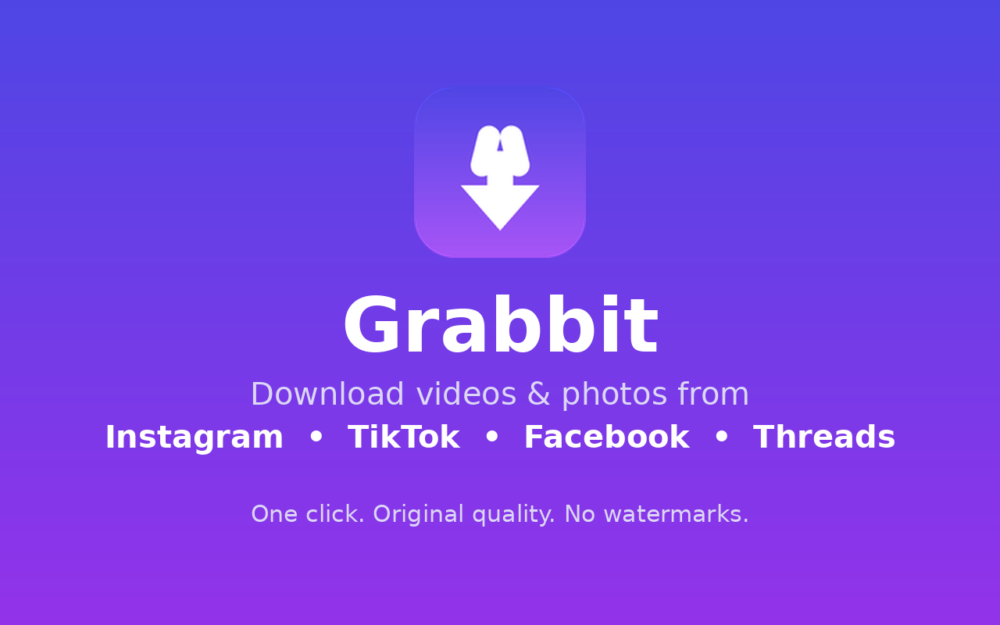
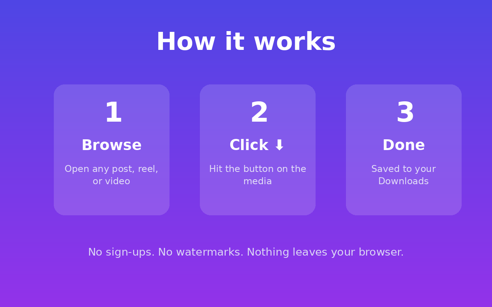
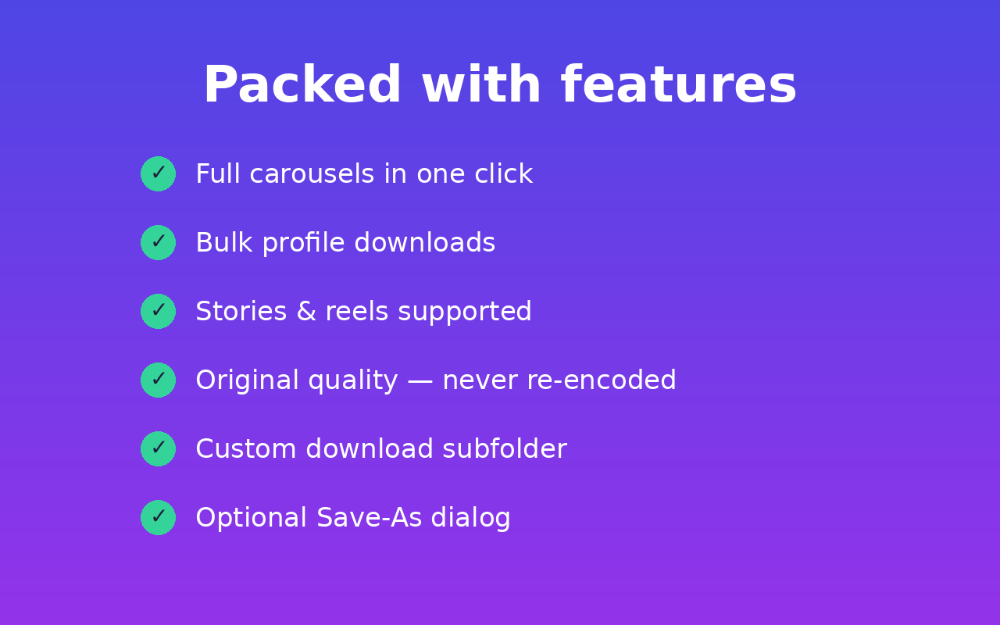

# 🐰 Grabbit

**One-click video & photo downloader for Instagram, TikTok, Facebook & Threads.**

Browse to any post or video, hit the ⬇ button, done — saved to your Downloads folder in original quality. No watermarks, no sign-ups, nothing leaves your browser.

## Features

- Instagram posts, reels, stories & full carousels
- TikTok videos in original quality
- Facebook & Threads videos
- Bulk profile downloads
- Custom download subfolder + optional Save-As dialog
- Original quality — never re-encoded

## Screenshots

## Install

**From the Chrome Web Store** (recommended): link coming soon — the listing is under review.

**Load unpacked (developers):**
1. Download or clone this repo
2. Open `chrome://extensions`, enable **Developer mode**
3. Click **Load unpacked** and select this folder

## Privacy

Grabbit does not collect, store, or transmit any personal data. Everything runs locally in your browser. Full policy: [privacy-policy.html](privacy-policy.html)

## License

MIT — do what you want, just don't blame the rabbit.
